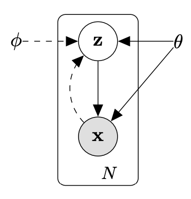

Variant models of VAE based on Pytorch
=======

1.VAE

https://arxiv.org/pdf/1312.6114.pdf

$$
\log p _ { \boldsymbol { \theta } } \left( \mathbf { x } ^ { ( i ) } \right) \geq \mathcal { L } \left( \boldsymbol { \theta } , \boldsymbol { \phi } ; \mathbf { x } ^ { ( i ) } \right) = \mathbb { E } _ { q _ { \phi } ( \mathbf { z } | \mathbf { x } ) } \left[ - \log q _ { \phi } ( \mathbf { z } | \mathbf { x } ) + \log p _ { \boldsymbol { \theta } } ( \mathbf { x } , \mathbf { z } ) \right]
$$
